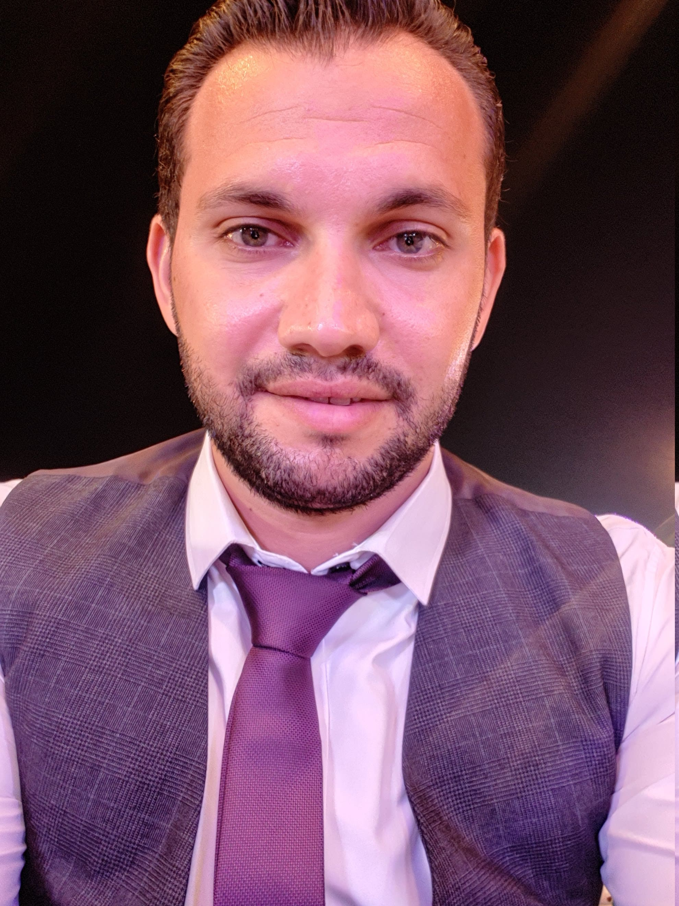

<!-- Profile Image -->

  

<h1 align="center">👨‍💻 Abdelrahman Ali – Full-Stack Web Developer</h1>

  📍 Ismailia, Egypt • 
  📧 <a href="mailto:abdelrahmanali102@gmail.com">abdelrahmanali102@gmail.com</a> • 
  📱 +20 1060101131  

  🔗 <a href="https://www.linkedin.com/in/abdelrahman-ali-04664a185/">LinkedIn</a> • 
  🔗 <a href="https://github.com/abdo-ali">GitHub</a>

---

## 🚀 About Me  
Full-Stack Web Developer with 2+ years of experience building dynamic, data-driven web applications using the **PERN stack (PostgreSQL, Express.js, React, Node.js)**.  
Skilled in designing RESTful APIs, database management, and creating responsive, user-friendly interfaces.  
Strong problem-solving mindset and passion for delivering scalable, modern web solutions.  

---

## 🛠️ Tech Stack  

  
  
  
  
  
  
  
  
  
  
  
  
  
  

---

## 💼 Professional Experience  

### 💻 Full-Stack Developer (Freelance & Projects)  
📍 Remote | 🗓️ 2022 – Present  
- Designed and developed full-stack applications using Node.js, Express, PostgreSQL, and React.  
- Built and deployed RESTful APIs for multi-user systems with secure authentication.  
- Created responsive UIs with React, Bootstrap, and Tailwind, improving user engagement.  
- Optimized SQL queries and database schemas, reducing query execution time by up to 20%.  

### 🛰️ Site Engineer – IT & Networking  
📍 Suiz Canal Authority | 🗓️ Aug 2016 – Present  
- Installed and configured network infrastructure (CCTV, IP cameras, monitoring systems).  
- Handled technical maintenance and troubleshooting for large-scale security and data systems.  
- Integrated network systems to improve operational efficiency and reliability.  

---

## 📌 Key Projects  

### 📚 [Book Notes App](https://github.com/abdo-ali/book-notes)  
- Full-stack book-tracking system with add/manage/annotate features.  
- PostgreSQL schema + Express.js CRUD operations.  

### ✅ [TODO List](https://github.com/abdo-ali/todo-list)  
- Multi-user task management app with authentication.  
- Backend: Node.js + PostgreSQL CRUD functionality.  

### ✍️ [Blog Web App](https://github.com/abdo-ali/blog-web-app/tree/main)  
- User authentication, CRUD posts, and EJS rendering.  
- Full-stack (frontend + backend).  

### 🌐 Portfolio Websites  

- 🖼️ **[Elzero Template](https://abdo-ali.github.io/elzero/)**  
  Responsive web template built with HTML5, CSS3, and JavaScript.  

- 🎨 **[Kasper Project](https://abdo-ali.github.io/kasper-project/)**  
  Modern multi-page website featuring portfolio gallery and responsive UI.  

- 🏷️ **[Leon Project](https://abdo-ali.github.io/leon-project-1/)**  
  Clean and responsive landing page template using HTML5 & CSS3.  

---

## 🎓 Education  
**Bachelor of Computer Science & Information**  
Suiz Canal University, Ismailia, Egypt | Oct 2016 – Jul 2021  
📊 Grade: Very Good (76.4%)  

---

## 📫 Get in Touch  
💌 [Email](mailto:abdelrahmanali102@gmail.com)  
🔗 [LinkedIn](https://www.linkedin.com/in/abdelrahman-ali-04664a185/)  
🔗 [GitHub](https://github.com/abdo-ali)  
